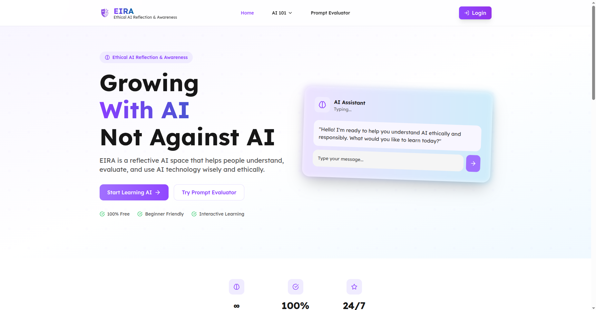

<div align="center">
<a href="[https://github.com/novelxv/EIRA](https://github.com/novelxv/EIRA)">

</a>
<h3 align="center">EIRA - Ethical Intelligence & Responsible AI</h3>
<p align="center">A comprehensive platform for Interactive Ethical AI Education</p>
</div>

[](https://reactjs.org/)
[](https://fastapi.tiangolo.com/)
[](https://python.org/)

-----

## Table of Contents

1.  [System Overview](https://www.google.com/search?q=%23system-overview)
2.  [Key Features](https://www.google.com/search?q=%23key-features)
3.  [Tech Stack](https://www.google.com/search?q=%23tech-stack)
4.  [System Architecture](https://www.google.com/search?q=%23system-architecture)
5.  [How to Run](https://www.google.com/search?q=%23how-to-run)
6.  [API Documentation](https://www.google.com/search?q=%23api-documentation)
7.  [Screenshots](https://www.google.com/search?q=%23screenshots)
8.  [Acknowledgments](https://www.google.com/search?q=%23acknowledgments)


# 📋 System Overview

EIRA (Ethical Intelligence & Responsible AI) is a comprehensive platform designed to support the responsible and ethical use of AI. This system provides various tools for:

  - **AI Education**: A learning platform for AI literacy.
  - **AI Prompt Evaluation**: Assesses prompt quality using research-backed criteria.

The platform prioritizes **data privacy**, **computational efficiency**, and the **Indonesian cultural context**, with support for both English and Indonesian languages.


# ✨ Key Features

## 🎓 AI Education & Simulation

  - **AI Literacy Wizard**: Interactive learning modules about AI.

## 📝 Prompt Evaluation

  - **Dual Engine**: Gemini 2.5 Pro & GoToCompany/gemma2-9b-cpt-sahabatai-v1-instruct
  - **5 Evaluation Criteria**: Clarity, Specificity, Ethics, Effectiveness, Bias Risk
  - **Research-backed**: Based on guidelines from OpenAI, Google AI, and Anthropic.
  - **Indonesian Optimized**: Special evaluation criteria for the Indonesian cultural context.

## 🤖 Local Text Generation

  - **Model**: GoToCompany/gemma2-9b-cpt-sahabatai-v1-instruct
  - **8-bit Quantization**: Up to 50% memory efficiency.
  - **Conversation Support**: Multi-turn conversations with history.
  - **Privacy First**: All processing is done locally.

<a name="tech-stack"></a>

# 🛠 Tech Stack

## Frontend

  - **React 18** + **TypeScript** - Modern UI framework
  - **Vite** - Fast build tool and development server
  - **Tailwind CSS** - Utility-first CSS framework
  - **Framer Motion** - Smooth animations and transitions
  - **Lucide React** - Beautiful icon set

## Backend

  - **FastAPI** - High-performance API framework
  - **Python 3.8+** - Core programming language
  - **Transformers** - Hugging Face model integration
  - **PyTorch** - Deep learning framework
  - **BitsAndBytesConfig** - Model quantization

## AI/ML Models

  - **Gemini 2.5 Pro** - Advanced prompt evaluation
  - **GoToCompany/gemma2-9b-cpt-sahabatai-v1-instruct** - Local Indonesian LLM
  - **desklib/ai-text-detector-v1.01** - AI content detection

## Development Tools

  - **Docker** - Containerization
  - **Loguru** - Advanced logging
  - **Pydantic** - Data validation
  - **CORS** - Cross-origin resource sharing
  - **Flask** - Local gateway service

<a name="system-architecture"></a>

# 🏗 System Architecture

```
┌─────────────────┐    ┌─────────────────┐    ┌─────────────────┐
│   Frontend      │    │  Local Gateway  │    │    Backend      │
│   (React)       │◄──►│    (Flask)      │◄──►│   (FastAPI)     │
│                 │    │                 │    │                 │
│ • AI Simulator  │    │ • Proxy Layer   │    │                 │
│ • Prompt Eval   │    │ • CORS Handler  │    │ • Text Gen      │
│ • Content Det   │    │ • Error Handling│    │ • Prompt Eval   │
│ • AI Education  │    │ • Load Balancing│    │ • Model Loading │
└─────────────────┘    └─────────────────┘    └─────────────────┘
         │                       │                       │
         │                       │                       │
         ▼                       ▼                       ▼
┌─────────────────┐    ┌─────────────────┐    ┌─────────────────┐
│   User Interface│    │  API Gateway    │    │   ML Models     │
│                 │    │                 │    │                 │
│ • Modern UI/UX  │    │ • Rate Limiting │    │ • Gemini API    │
│ • Responsive    │    │ • Monitoring    │    │ • Local LLM     │
│ • Accessibility │    │ • Caching       │    │ • AI Detector   │
└─────────────────┘    └─────────────────┘    └─────────────────┘
```

<a name="how-to-run"></a>

# 🚀 How to Run

## 1. Prerequisites

  - Ensure you have **Python 3.8+** and **Node.js 16+** installed.
  - A **GPU with CUDA** support (optional, for optimal performance).
  - A minimum of **16GB RAM** (for model loading).

<!-- end list -->

```bash
# Clone the repository
git clone https://github.com/novelxv/EIRA.git
cd EIRA
```

## 2\. Setup Backend (Local)

```bash
# Navigate to the backend directory
cd backend

# Create a virtual environment
python -m venv .venv
source .venv/bin/activate  # Linux/Mac
# or
.venv\Scripts\activate     # Windows

# Install dependencies
pip install -r requirements.txt

# Set up environment variables
cp .env.example .env
# Edit the .env file with your configuration

# Generate an API key
python -c "import uuid; print(str(uuid.uuid4()))"

# Run the backend server
uvicorn huggingfastapi.main:app --reload --host 0.0.0.0 --port 8000
```

## 3\. Setup Frontend

```bash
# Navigate to the frontend directory (in a new terminal)
cd frontend

# Install dependencies
npm install

# Run the development server
npm run dev
```

## 4\. Setup Local Gateway (Optional)

```bash
# Navigate to the local_gateway directory (in a new terminal)
cd local_gateway

# Install dependencies
pip install -r requirements.txt

# Run the gateway
python app.py
```

## 5\. Deployment on Google Colab (with GPU)

For those without a local GPU or who want a quick way to test the model's full inference power, we provide a Google Colab notebook.

1.  Navigate to the `backend` folder and open the `.ipynb` notebook file in Google Colab.
2.  Before running any cells, ensure the runtime is set to use a GPU. Go to **Runtime \> Change runtime type** and select **T4 GPU** (or any available GPU) from the Hardware accelerator dropdown.
3.  You will need an [ngrok](https://ngrok.com/) account and an authentication token. Paste your token into the designated cell.
4.  Run all cells sequentially. The final cell will start the FastAPI server and output a public `ngrok` URL.
5.  Use this public URL as the backend endpoint for your locally running frontend.

## 6\. Access the Application

  - **Frontend**: http://localhost:5173
  - **Backend API**: http://localhost:8000
  - **API Documentation**: http://localhost:8000/docs
  - **Local Gateway**: http://localhost:5000

## 7. Docker Setup (Alternative)

```bash
# Backend with Docker
cd backend
docker-compose up
```

<a name="api-documentation"></a>

# 📚 API Documentation

## Endpoint Summary

| Category | Endpoint | Method | Description |
|----------|----------|--------|-------------|
| **Health** | `/health/heartbeat` | GET | Basic health check |
| **AI Detection** | `/api/v1/detect-ai` | POST | Detects AI-generated text |
| **Text Generation** | `/api/v1/generate-text` | POST | Generates text with the local model |
| **Chat** | `/api/v1/chat` | POST | Conversational chat interface |
| **Prompt Eval** | `/api/v1/evaluate` | POST | Evaluates prompts using Gemini |
| **Prompt Eval** | `/api/v1/evaluate-goto` | POST | Evaluates prompts using the GoTo/Indonesian model |

## Example Usage

### AI Detection

```bash
curl -X POST "http://localhost:8000/api/v1/detect-ai" \
  -H "Content-Type: application/json" \
  -H "Authorization: Bearer YOUR_API_KEY" \
  -d '{"text": "Your text to analyze"}'
```

### Text Generation

```bash
curl -X POST "http://localhost:8000/api/v1/generate-text" \
  -H "Content-Type: application/json" \
  -H "Authorization: Bearer YOUR_API_KEY" \
  -d '{
    "text": "Explain what artificial intelligence is",
    "max_new_tokens": 256,
    "temperature": 0.7
  }'
```

### Prompt Evaluation

```bash
curl -X POST "http://localhost:8000/api/v1/evaluate-goto" \
  -H "Content-Type: application/json" \
  -H "Authorization: Bearer YOUR_API_KEY" \
  -d '{"prompt": "Create a complete guide about machine learning"}'
```

📖 **Full Documentation**:

  - [Text Generation API](https://www.google.com/search?q=backend/TEXT_GENERATION_API.md)
  - [GoTo Prompt Evaluation API](https://www.google.com/search?q=backend/GOTO_PROMPT_EVALUATION_API.md)

<a name="screenshots"></a>

# 📸 Screenshots

## Main Page



-----

<a name="acknowledgments"></a>

## 🙏 Acknowledgments

  - [Hugging Face](https://huggingface.co/) for their models and tools.
  - [OpenAI](https://openai.com/) for their research guidelines.
  - [Google AI](https://ai.google/) for their prompt engineering principles.
  - [Anthropic](https://anthropic.com/) for their Constitutional AI research.
  - [GoToCompany](https://github.com/GoToCompany) for the Indonesian LLM.

## 📞 Contact

  - **Repository**: [https://github.com/novelxv/EIRA](https://github.com/novelxv/EIRA)
  - **Issues**: [https://github.com/novelxv/EIRA/issues](https://github.com/novelxv/EIRA/issues)

-----

<div align="center">
<p>Made with ❤️ for Ethical AI Development</p>
<p>🇮🇩 Proudly supporting the Indonesian AI ecosystem</p>
</div>